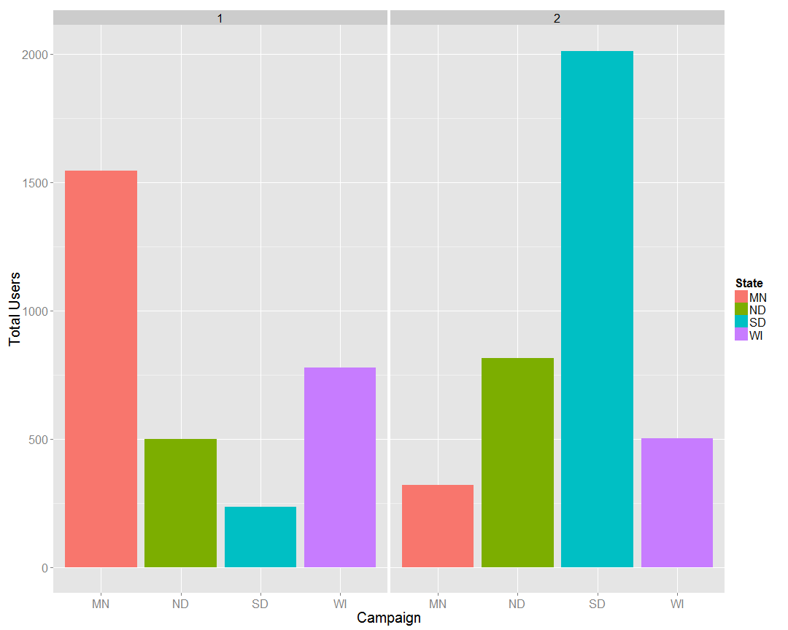
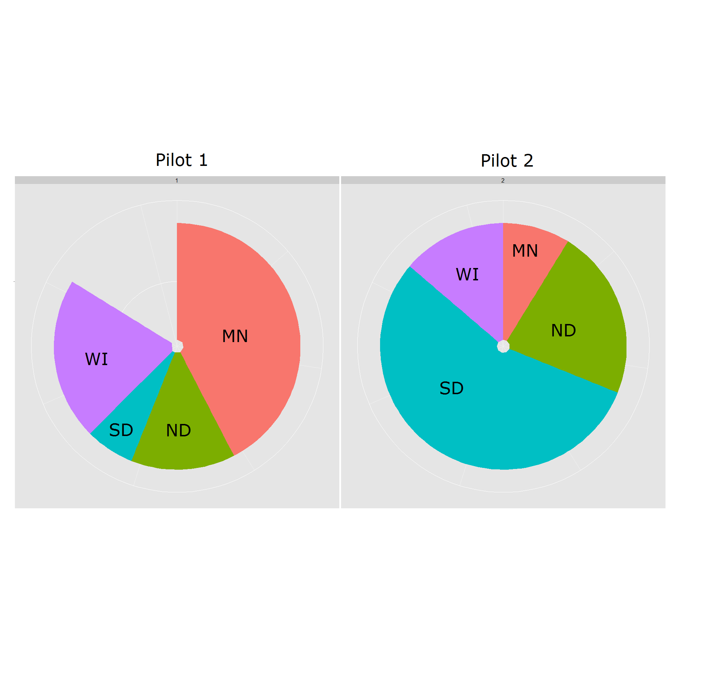
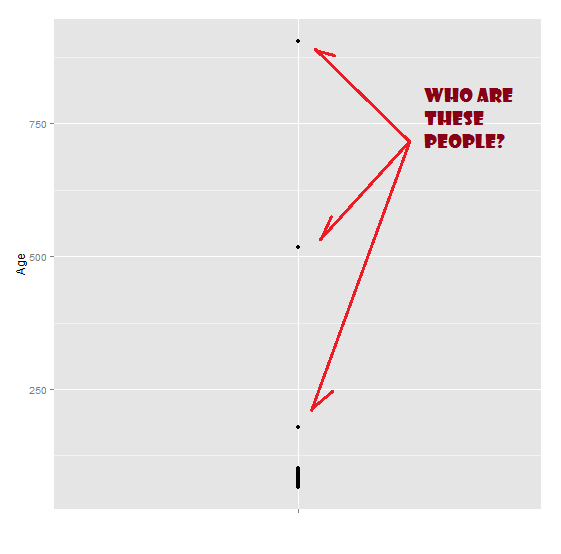

Initech Pilot Campaign Results
========================================================
author: Miadad Rashid
date: June 30, 2015

Introduction
========================================================

&nbsp;&nbsp;&nbsp;&nbsp;&nbsp;Our client, Insurance Insights and Technologies (Initech), recently asked us to set up a special program on our site. We conducted two separate pilot marketing campaigns to promote this program to their members on our site. We need to analyze these two pilot campaigns and inform the client of the results.

Data Inconsistencies
========================================================

+ 14 unique **state** values instead of 4
+ There are 7 unique **month** values, yet there are only 3 distinct months (March, April, May)
+ Only 6 of the observations in the **month** variable were labeled `Mar`
+ There are 181 `zero` values and 1 `NA` value for the **gender** variable

Success Rates
========================================================
### General Campaign Success Rate

| Pilots|  YES|   NO| ConversionRate|
|------:|----:|----:|--------------:|
|      1|  646| 2411|           21.1|
|      2| 1090| 2558|           29.9|
+ Increase of 8.8% between April and May

### Success Rate by State

| State| Pilots| YES|   NO| ConversionRate| Con.Difference|
|-----:|------:|---:|----:|--------------:|--------------:|
|    MN|      1| 235| 1311|           15.2|             MN|
|    MN|      2|  32|  288|           10.0|           -5.2|
|    ND|      1| 166|  333|           33.3|             ND|
|    ND|      2| 235|  580|           28.8|           -4.5|
|    SD|      1|  91|  143|           38.9|             SD|
|    SD|      2| 753| 1259|           37.4|           -1.5|
|    WI|      1| 154|  624|           19.8|             WI|
|    WI|      2|  70|  431|           14.0|           -5.8|

Shift in Target Market
========================================================
Concentration of Users per Pilot
 

===
### Conitued...

+ In the first Pilot, MN(**orange**) has 50.6% of the user base
+ In the second Pilot, target market shifts - SD(**blue**) takes 55.2% of the cut while MN drops to 8.8%
+ The blank spot in Pilot 1 represents the the raw difference in user base between the Pilots
+ Without data outlining attributes of the Pilots, it is hard to tell whether shift in target market overall use response rates

***

***
Pilot 1

|   MN|   ND|  SD|   WI|
|----:|----:|---:|----:|
| 50.6| 16.3| 7.7| 25.4|
Pilot 2

|  MN|   ND|   SD|   WI|
|---:|----:|----:|----:|
| 8.8| 22.3| 55.2| 13.7|

Gender-Based Conversion Rates
=======================================================

|State | Pilots| T.Female| F.Con.Rate| T.Male| M.Con.Rate|
|:-----|------:|--------:|----------:|------:|----------:|
|MN    |      1|      718|       15.7|   14.7|       14.7|
|MN    |      2|      151|       11.9|    8.5|        8.5|
|ND    |      1|      229|       34.1|   32.5|       32.5|
|ND    |      2|      405|       31.6|   26.2|       26.2|
|SD    |      1|      114|       43.0|   35.8|       35.8|
|SD    |      2|      969|       37.7|   36.9|       36.9|
|WI    |      1|      395|       21.3|   18.4|       18.4|
|WI    |      2|      232|       12.1|   16.0|       16.0|

+ Conversion rate falls across the board with
Pilot 2

|Gender |   MN|   ND|   SD|   WI|
|:------|----:|----:|----:|----:|
|FEMALE | -3.8| -2.5| -5.3| -9.2|
|MALE   | -6.2| -6.3|  1.1| -2.4|

=======================================================

# Could their be a link between the Pilots and the Age of the respondents? 

+ Extracted **Age** from **birthdate**
+ Ran into some curious data 
+ ...Some had to be removed

=======================================================

|     | user_id|state |gender |birthdate  |age (years) |
|:----|-------:|:-----|:------|:----------|:-----------|
|1895 |  777251|WI    |MALE   |1837-07-20 |178.1       |
|3801 |  863186|WI    |FEMALE |1111-01-01 |905.1       |
|6170 |  621182|SD    |FEMALE |1498-02-08 |517.7       |

How the Campaigns affect the age of the Respondents
=======================================================

|State | Pilots|Means |Difference |
|:-----|------:|:-----|:----------|
|MN    |      1|73.6  |-          |
|MN    |      2|79.1  |5.5        |
|ND    |      1|73.1  |-          |
|ND    |      2|77.2  |4.1        |
|SD    |      1|75.2  |-          |
|SD    |      2|77.7  |2.5        |
|WI    |      1|73.6  |-          |
|WI    |      2|77.8  |4.2        |

Probability Chart
=======================================================

### What are the chances that the effect we are seeing from Pilot 2 is a *fluke*?

+ The **Mann-Whitney U-test** was performed on the aggregate-by-age data
+ The **p-values** are significantly below the **p-critical** of 0.05
+ the **p-value** is the probability our results were flukes - the **null-hypothesis**.

***

|States |   Chance|
|:------|--------:|
|All    | 0.00e+00|
|MN     | 9.16e-05|
|ND     | 0.00e+00|
|SD     | 4.24e-05|
|WI     | 5.00e-07|

+ Which means, we reject the **null-hypothesis**, that the samples come from the same population, and accept the **alternative-hypothesis**, that condition(**change-in-campaign**) has an affect on the outcome(**age-of-respondent**)

=======================================================

# So what does this mean?
# ...

Conclusion
=======================================================

&nbsp;&nbsp;&nbsp;&nbsp;&nbsp;From what I understand, Novu's goal is to work with the Healthcare Industry to bring their constituents up to a higher level of Health and Wellness. For me, that also implies that we are a Health Risk Mitigator.  And it is a constant, that the older one gets the higher the chances of health complications become.  In the perspective of Insurance Purveyors, the higher the health risk means higher liability for them.

&nbsp;&nbsp;&nbsp;&nbsp;&nbsp;Although the conversion rates were lower for Pilot 2, it successfully targeted the older, higher-risk demographics, and got them to respond.  It should also be noted that regardless of the seemingly lower performance rate, Pilot 2 hit a higher raw conversion count.

&nbsp;&nbsp;&nbsp;&nbsp;&nbsp;Personally, I would have liked to have performed some A/B tests on the sites themselves.  Ideally, we would be able to identify and implement the positive outcomes of the high success rates of Pilot 1 with the appeal to a higher age demographic and raw numbers of Pilot 2 in a 3rd Pilot Campaign.
